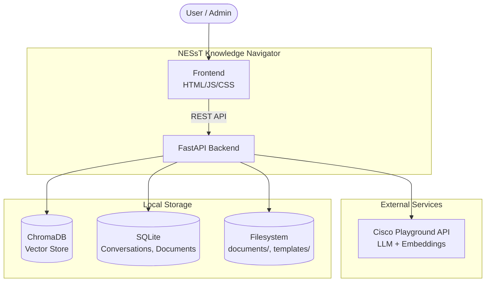
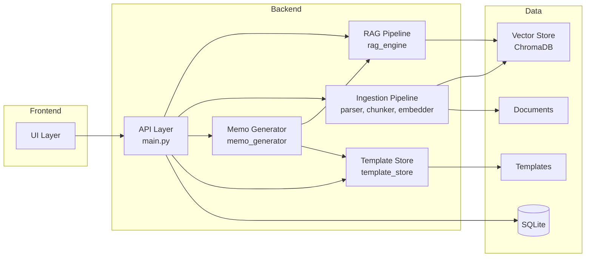
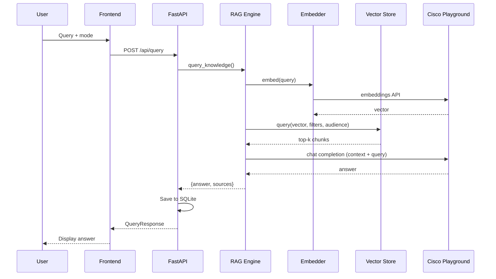
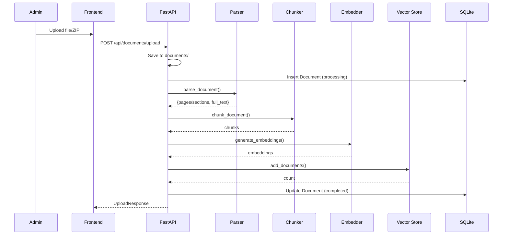
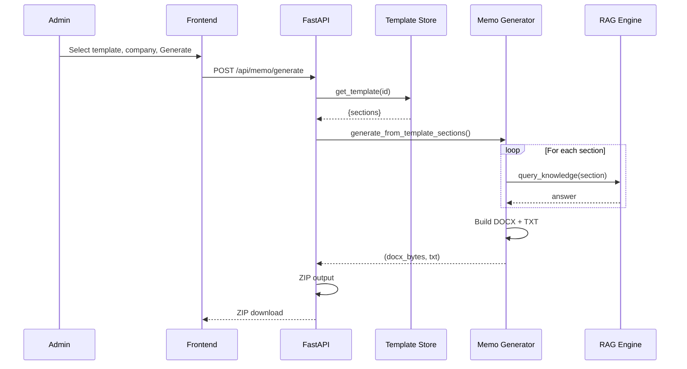
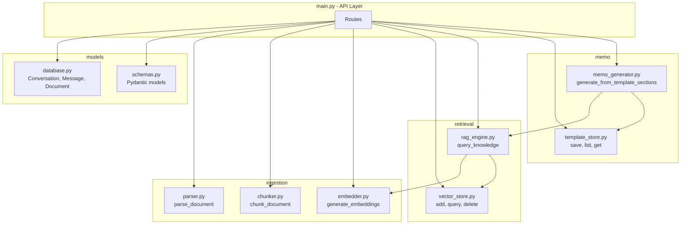
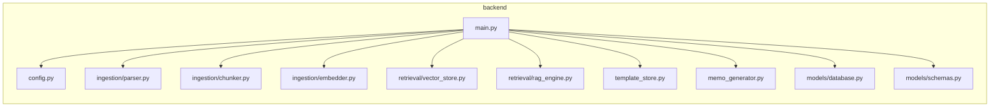
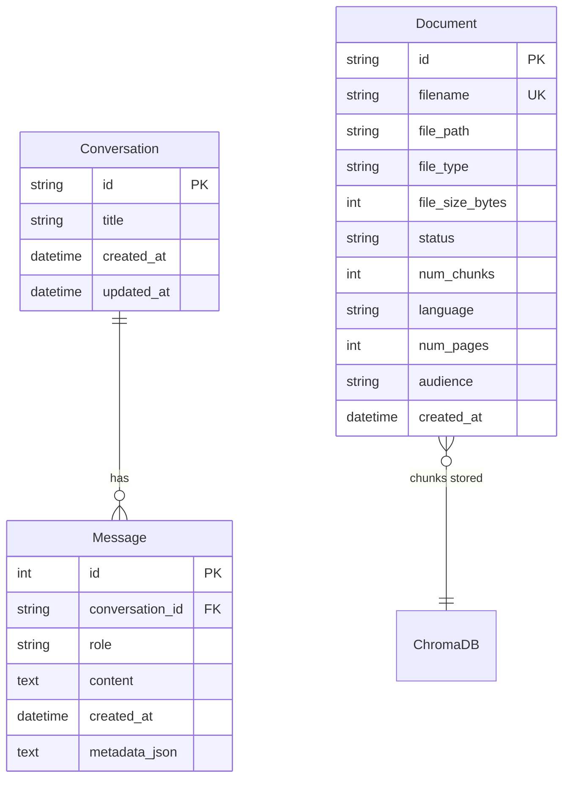
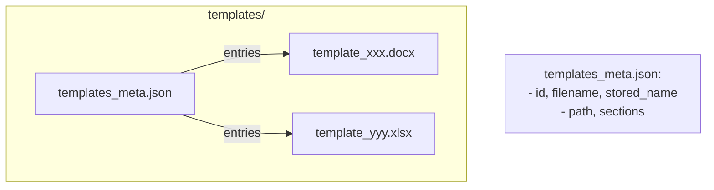

# NESsT Knowledge Navigator — Architecture (HLD & LLD)

This document provides High-Level Design (HLD) and Low-Level Design (LLD) diagrams to support long-term maintenance after the hackathon.

---

## 1. High-Level Design (HLD)

### 1.1 System Context

### 1.2 Top-Level Component View

### 1.3 Data Flow — Query (RAG)

### 1.4 Data Flow — Document Ingestion

### 1.5 Data Flow — Memo Generation

---

## 2. Low-Level Design (LLD)

### 2.1 Backend Module Dependencies

### 2.2 Directory & File Map

### 2.3 Database Schema (SQLite)

### 2.4 ChromaDB Metadata (per chunk)

| Field | Type | Description |
|-------|------|-------------|
| `source_file` | str | Original filename |
| `page` | int | Page number (PDF) |
| `section` | str | Section heading (DOCX/PPTX) |
| `slide` | int | Slide number (PPTX) |
| `audience` | str | `public` or `internal` |

### 2.5 Template Store Structure

### 2.6 Key Functions Reference

| Module | Function | Purpose |
|--------|----------|---------|
| `main.py` | `handle_query` | Query → RAG → save conversation |
| `main.py` | `upload_document` | Parse → chunk → embed → store |
| `main.py` | `upload_zip` | Extract ZIP, ingest supported files |
| `main.py` | `upload_template` | Save DOCX/Excel, parse sections |
| `main.py` | `generate_memo` | Call memo_generator, return ZIP |
| `rag_engine.py` | `query_knowledge` | Embed → retrieve → LLM → answer |
| `vector_store.py` | `query` | ChromaDB similarity search |
| `vector_store.py` | `add_documents` | Add chunks with embeddings |
| `template_store.py` | `parse_template_sections` | DOCX headings or Excel col A |
| `memo_generator.py` | `generate_from_template_sections` | RAG per section, build DOCX |

---

## 3. Deployment Considerations

### 3.1 Single-Process Deployment

- **Uvicorn** runs FastAPI in a single process
- **ChromaDB** uses file-based persistence; one writer
- **SQLite** single-writer; sufficient for hackathon scale

### 3.2 Future Scope & Azure-Ready Adjustments

*For full future scope (auth, analytics, integrations, etc.), see `docs/SOLUTION_DOCUMENTATION.md` §10.*

| Component | Current | Azure-Ready |
|-----------|---------|-------------|
| Auth | Header-based role | Azure AD / OAuth2 |
| Secrets | `.env` | Azure Key Vault |
| DB | SQLite | Azure SQL / PostgreSQL |
| Vector Store | ChromaDB file | Azure AI Search / Pinecone |
| Static | Local mount | Azure Blob / CDN |

---

## 4. Quick Reference for Maintainers

| Task | Files to Edit |
|------|---------------|
| Add API endpoint | `backend/main.py` |
| Change RAG behavior | `backend/retrieval/rag_engine.py` |
| Support new document type | `backend/ingestion/parser.py` |
| Change chunking | `backend/ingestion/chunker.py` |
| Add template format | `backend/template_store.py` |
| Change memo layout | `backend/memo_generator.py` |
| Add DB table/column | `backend/models/database.py` |
| Change API schemas | `backend/models/schemas.py` |
| Frontend behavior | `frontend/app.js` |
| Styling | `frontend/style.css` |
| Config / env vars | `backend/config.py`, `.env` |

---

*Last updated: March 2025*
